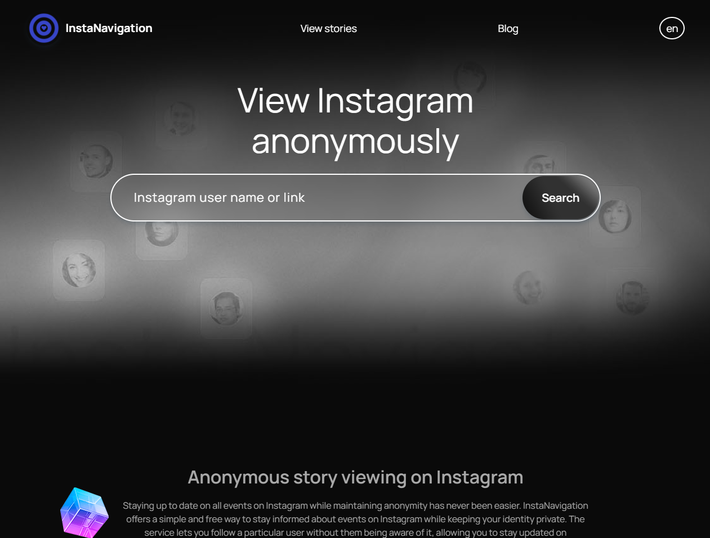
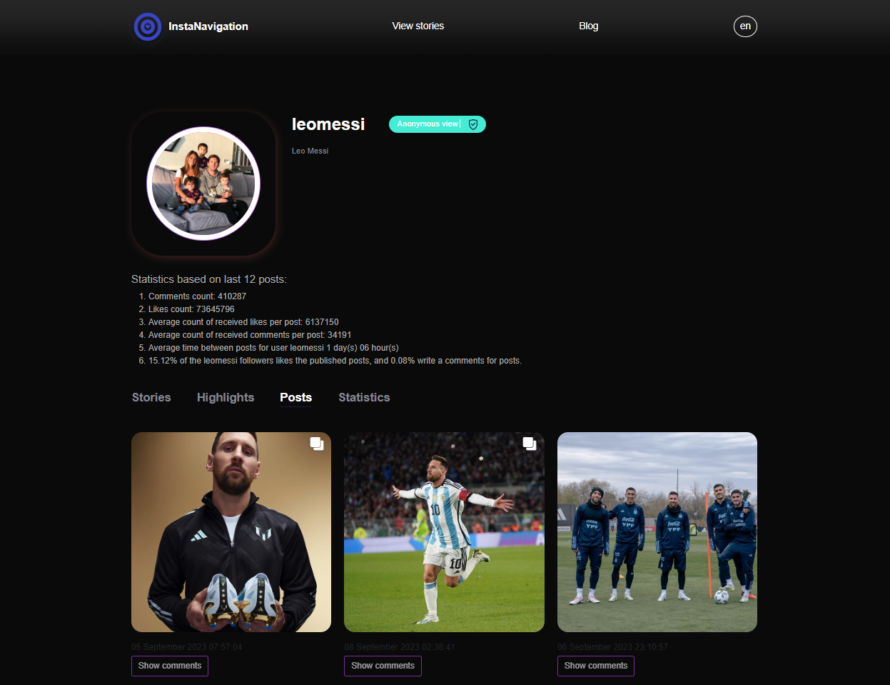
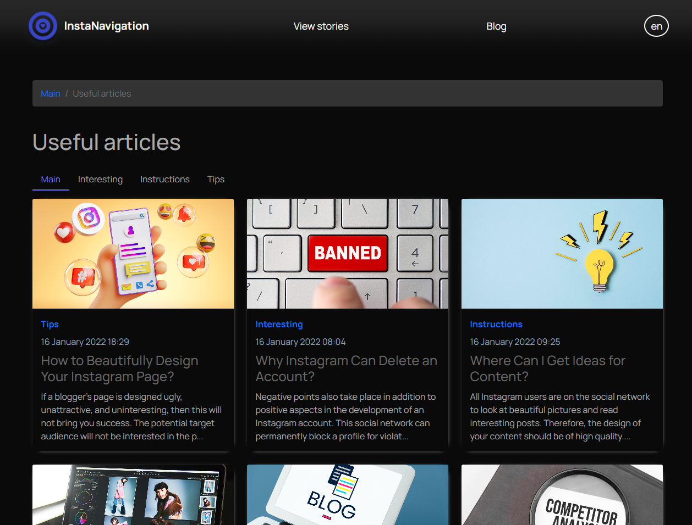
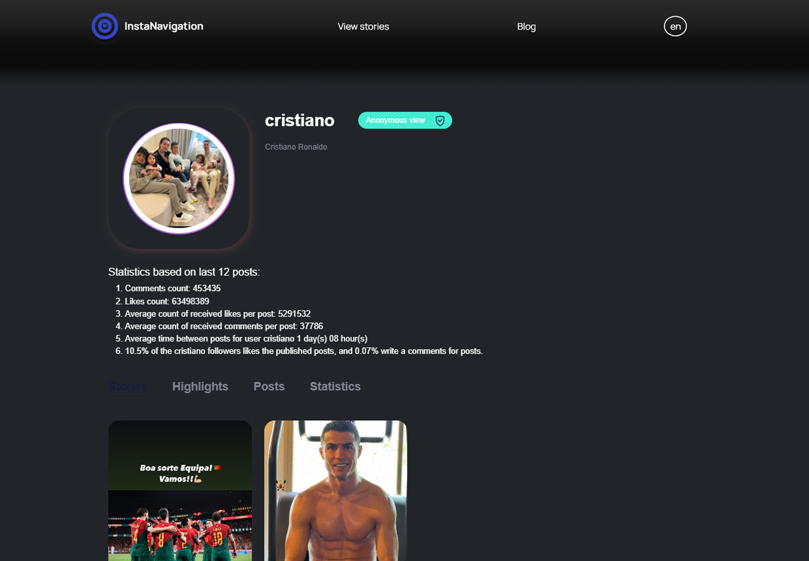
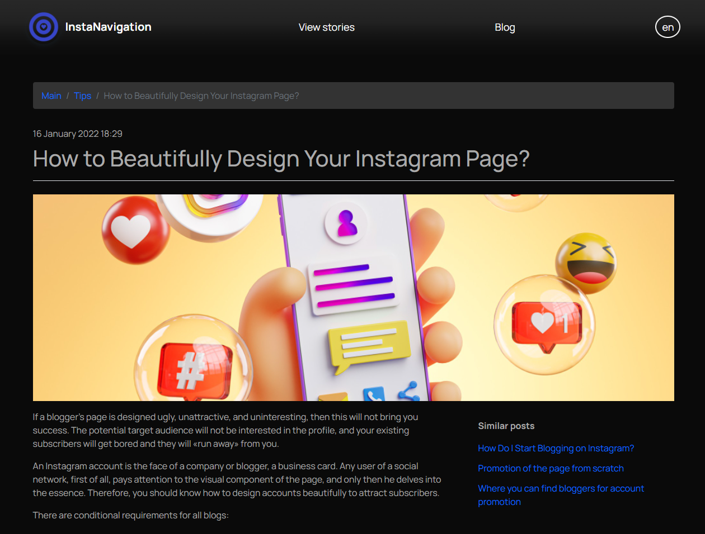
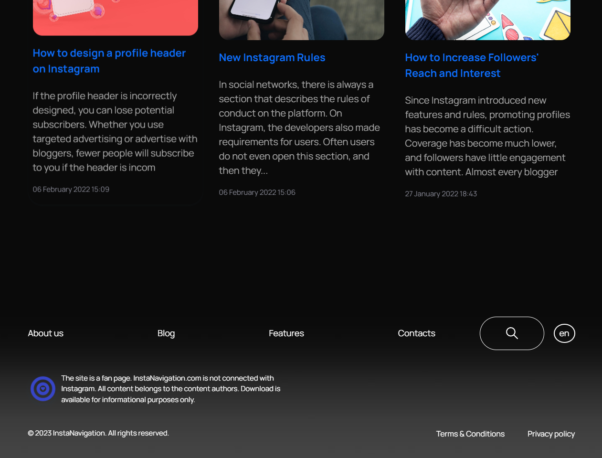
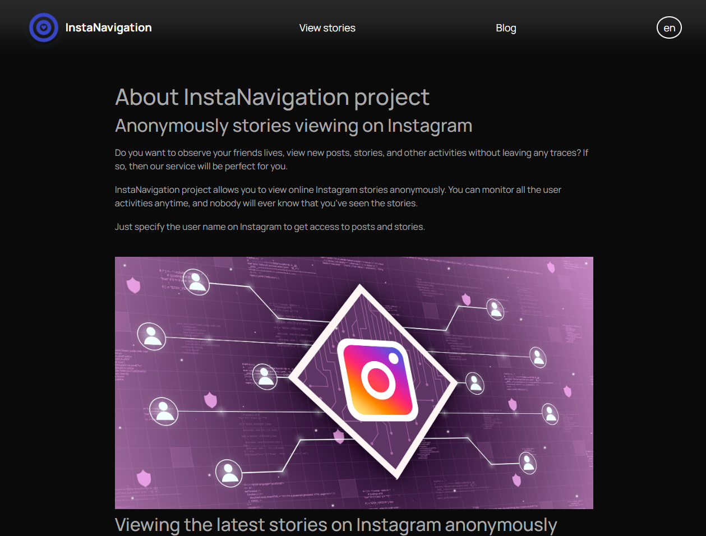
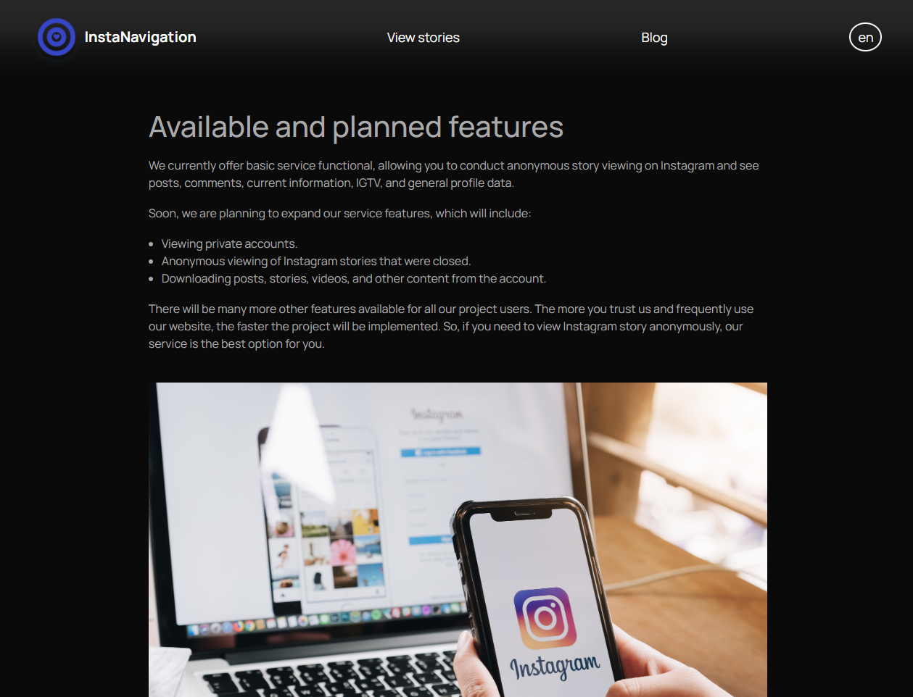
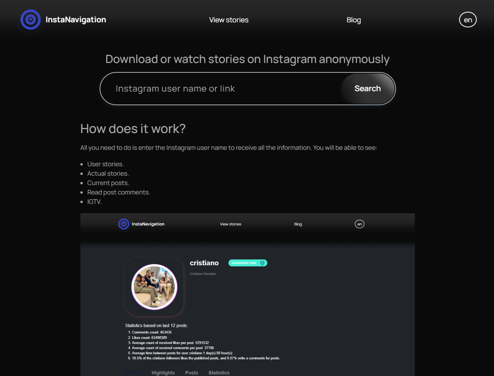
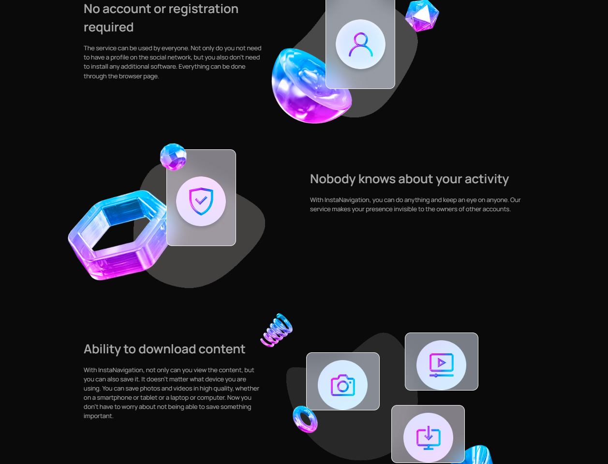

# Instanavigation
### Anonymous story viewing on Instagram
<p style="background-color: white; color: darkblue; font-weight: bold; padding: 20px; border-radius: 20px">
Staying up to date on all events on Instagram while maintaining anonymity has never been easier. InstaNavigation offers a simple and free way to stay informed about events on Instagram while keeping your identity private. The service lets you follow a particular user without them being aware of it, allowing you to stay updated on interesting news and download relevant content as well.
</p>

## Features

The main feature of our service is absolute and complete anonymity. Want to watch Stories? Please do. Want to download videos and photos? No problem. Want to see who left likes and comments under posts? That information will also be available.

Another feature of InstaNavigation is that you don't need to first log into your account, provide a password, and then set up an anonymous mode to use the service. It's much simpler, all you need to do is specify the user name of the person you're interested in in a certain field. This is a convenient and well-thought-out approach.

On the one hand, it serves as an additional security measure, as if you don't enter any data, you don't have to worry about it being disclosed. On the other hand, it allows users who are not registered on Instagram to also view interesting pages on the social network.

<div style="display: flex;">
    <div style="width: 50%">
        
    </div>
    <div style="width: 50%;">
        <div style="display: flex;">
            <div style="width: 50%">
                
            </div>
            <div style="width: 50%; display: flex;">
                
            </div>
        </div>
        <div style="display: flex;">
            <div style="width: 50%">
                
            </div>
            <div style="width: 50%; display: flex;">
                
            </div>
        </div>
    </div>
</div>
<i>Modern Dark Theme</i>
<div style="display: flex;">
    <div style="width: 50%">
        
    </div>
    <div style="width: 50%;">
        <div style="display: flex;">
            <div style="width: 50%">
                
            </div>
            <div style="width: 50%; display: flex;">
                
            </div>
        </div>
        <div style="display: flex;">
            <div style="width: 50%">
                
            </div>
            <div style="width: 50%; display: flex;">
                
            </div>
        </div>
    </div>
</div>

## Set up

<br/>
<span style="color: darkred; background-color: grey; margin: 10px; padding: 20px">
* PHP ^8.0 / Laravel ^10.0
</span>

<br/>

```
git clone https://github.com/hades255/varinder-instanavigation-laravel.git
```
```
composer install
```
```
php artisan serve
```

## Sponser

<a href="https://github.com/hades255">
 
 
<br/>
Varinder Pal Singh
</a>

### HADES
<a href="https://github.com/hades255"></a>